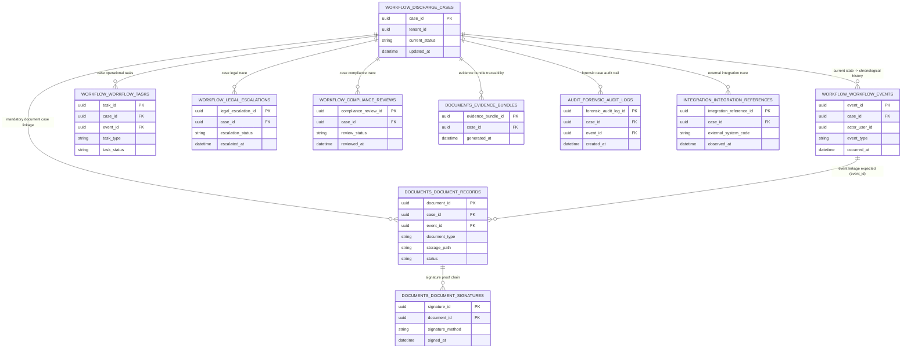

# CORE BACKBONE ER DIAGRAM

Date: 2026-03-13
Status: Architecture documentation (non-executable)

## Mermaid ER Diagram

Entity name mapping used in diagram:
- WORKFLOW_DISCHARGE_CASES = workflow.discharge_cases
- WORKFLOW_WORKFLOW_EVENTS = workflow.workflow_events
- WORKFLOW_WORKFLOW_TASKS = workflow.workflow_tasks
- WORKFLOW_LEGAL_ESCALATIONS = workflow.legal_escalations
- WORKFLOW_COMPLIANCE_REVIEWS = workflow.compliance_reviews
- DOCUMENTS_DOCUMENT_RECORDS = documents.document_records
- DOCUMENTS_DOCUMENT_SIGNATURES = documents.document_signatures
- DOCUMENTS_EVIDENCE_BUNDLES = documents.evidence_bundles
- AUDIT_FORENSIC_AUDIT_LOGS = audit.forensic_audit_logs
- INTEGRATION_INTEGRATION_REFERENCES = integration.integration_references

## Explanatory Notes

- Current state rule: `workflow.discharge_cases` is the canonical current-state case header for operational workflow decisions.
- Workflow history rule: `workflow.workflow_events` stores the complete chronological event history for each case.
- Document traceability rule: every `documents.document_records` row must link to `case_id`, and should link to `event_id` wherever operationally possible; any missing event linkage must be explicitly documented as an exception.
