# WathiqCare Smart Educational Consent Library

## Architecture & Design Package

**Phase:** Design Only  
**Status:** Proposed next mandatory phase after Public Signing Bridge PASS  
**Scope:** No code changes, no migrations, no module modifications, no breaking changes

---

## 1. System Architecture

### 1.1 Purpose

The WathiqCare Smart Educational Consent Library is a core product module that delivers procedure-specific patient education before consent text review and before signature capture. It must integrate with the existing consent workflow, template governance model, audit trail, OTP signing flow, and legal evidence package without weakening current module boundaries.

### 1.2 Architectural Principles

- Education is a first-class legal and clinical artifact, not a UI add-on.
- Education content is versioned independently from consent templates, but linked deterministically to consent execution.
- Education delivery must be reusable across 100+ consent templates.
- The design must preserve current consent generation, current signing APIs, and current evidence sidecar patterns.
- Educational completion evidence must be append-only and traceable.
- Source, license, and attribution must be explicit for every educational asset.

### 1.3 Logical Architecture

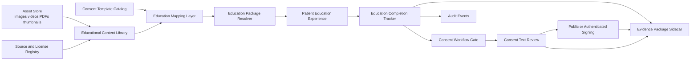

### 1.4 Runtime Boundaries

The module is designed as a sidecar domain with five logical services:

1. Education Catalog Service
   Responsible for package definitions, versioning, metadata, hashes, and template mappings.

2. Education Delivery Service
   Responsible for composing the patient-facing package, ordering content, localization, and device-adaptive asset selection.

3. Education Progress Service
   Responsible for acknowledgement, asset view tracking, FAQ interaction tracking, completion decisions, and durable evidence events.

4. Source and License Compliance Service
   Responsible for source provenance, usage rights, attribution requirements, expiry review, and asset approval status.

5. Consent Integration Orchestrator
   Responsible for inserting the education stage before consent text and signature, and for attaching education evidence to the legal evidence package.

### 1.5 Deployment Topology

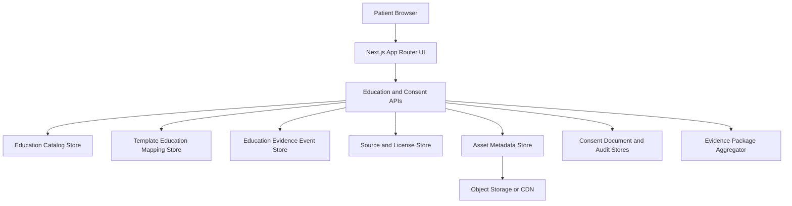

### 1.6 Non-Breaking Integration Strategy

- Authenticated module flows continue to own consent authoring and internal case operations.
- Public signing flows continue to own token validation, OTP verification, cookie-backed public session state, and signature capture.
- The new module inserts an education stage before consent review, but does not replace existing consent document storage.
- Existing consent templates remain authoritative for legal clauses.
- Existing evidence package flows remain authoritative for downstream bundle assembly.

---

## 2. Database Design

This section is logical design only. It does not propose migrations in this phase.

### 2.1 Core Entities

1. `education_packages`
   Canonical reusable educational package definitions.

2. `education_package_versions`
   Immutable package version records with version labels, content hash, publication state, and language availability.

3. `education_assets`
   Media and content units such as images, videos, illustrations, FAQ cards, pre-op instructions, and post-op instructions.

4. `education_asset_versions`
   Immutable asset versions with file hashes, derived thumbnails, transcripts, captions, and locale variants.

5. `education_package_asset_links`
   Ordered linkage between an education package version and its assets.

6. `education_template_mappings`
   Mapping between consent template versions and education package versions.

7. `education_source_registry`
   Provenance metadata for every source, institution, publisher, or clinician-authored educational item.

8. `education_license_registry`
   Rights model, reuse constraints, attribution requirements, expiry windows, and commercial usage status.

9. `education_completion_sessions`
   One runtime education session per consent execution or signing session.

10. `education_completion_events`
    Append-only event stream for education interaction and completion evidence.

11. `education_acknowledgements`
    Final patient acknowledgement record tied to an education session.

### 2.2 Logical Relationships

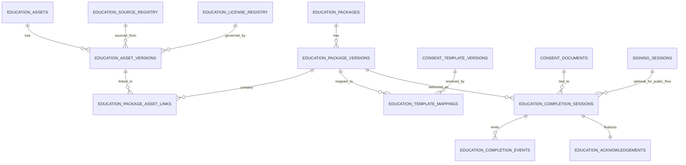

### 2.3 Key Columns by Entity

#### `education_packages`

- `id`
- `tenant_id` nullable for global library packages
- `package_key`
- `clinical_domain`
- `procedure_code`
- `title_ar`
- `title_en`
- `summary_ar`
- `summary_en`
- `status`
- `created_at`
- `updated_at`

#### `education_package_versions`

- `id`
- `education_package_id`
- `version_label`
- `content_hash`
- `version_status` (`draft`, `review`, `approved`, `published`, `retired`)
- `effective_from`
- `effective_to`
- `approval_user_id`
- `approval_timestamp`
- `package_manifest_json`
- `locale_set`
- `estimated_duration_seconds`

#### `education_assets`

- `id`
- `asset_key`
- `asset_type` (`image`, `video`, `faq`, `instruction`, `visual_risk_card`, `pdf`, `animation`)
- `clinical_topic`
- `default_locale`
- `status`

#### `education_asset_versions`

- `id`
- `education_asset_id`
- `version_label`
- `content_hash`
- `binary_hash` nullable for non-binary structured content
- `storage_uri`
- `thumbnail_uri`
- `transcript_uri`
- `caption_uri`
- `duration_seconds`
- `width`
- `height`
- `mime_type`
- `source_registry_id`
- `license_registry_id`
- `attribution_text`
- `locale`
- `review_status`

#### `education_template_mappings`

- `id`
- `template_version_id`
- `education_package_version_id`
- `mandatory_before_signature`
- `mandatory_before_consent_text`
- `completion_policy_json`
- `fallback_package_version_id`

#### `education_completion_sessions`

- `id`
- `tenant_id`
- `consent_document_id`
- `signing_session_id` nullable
- `education_package_version_id`
- `template_version_id`
- `started_at`
- `completed_at`
- `completion_status`
- `completion_score`
- `patient_acknowledged`
- `delivery_locale`
- `device_type`
- `browser`
- `ip_address`
- `session_hash`

#### `education_completion_events`

- `id`
- `education_completion_session_id`
- `event_type`
- `event_timestamp`
- `asset_version_id` nullable
- `event_sequence_no`
- `event_hash`
- `payload_json`

#### `education_acknowledgements`

- `id`
- `education_completion_session_id`
- `acknowledgement_text_hash`
- `acknowledged_by_name`
- `acknowledged_at`
- `acknowledgement_method`
- `metadata_json`

### 2.4 Hashing Model

The logical design uses three levels of hashing:

1. Asset hash
   Content integrity for a single educational item.

2. Package version hash
   Deterministic hash of ordered assets, FAQ payloads, instructions, and locale content.

3. Completion evidence hash
   Deterministic hash of session metadata, delivered package version, viewed assets, acknowledgement, and completion result.

### 2.5 Retention Model

- Package and asset versions are immutable once published.
- Completion events are append-only.
- License and source records retain full history even if a package is retired.
- Consent-linked education evidence remains queryable for the legal retention period.

---

## 3. Content Source Strategy

### 3.1 Source Categories

The content library should support four source classes:

1. WathiqCare-authored originals
   Best for visuals, FAQs, and reusable procedure explainers.

2. Hospital-approved local content
   Best for institution-specific pre-op and post-op instructions.

3. Licensed third-party clinical educational content
   Best for rich animations, validated illustrations, and specialty content.

4. Public-domain or openly licensed medical content
   Best for supplemental visuals where licensing is explicit and compatible.

### 3.2 Source Intake Pipeline

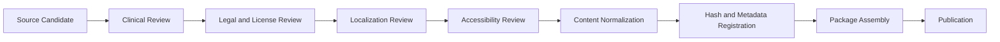

### 3.3 Source Quality Rules

- Clinical accuracy must be approved by designated medical governance reviewers.
- Arabic and English variants must be semantically aligned.
- Every video must have transcript and caption coverage.
- Every illustration must have source provenance and review timestamp.
- Risk and benefit visuals must distinguish educational illustration from legal consent language.

### 3.4 Content Governance Layers

- Clinical governance
- Legal governance
- Content operations governance
- Localization governance
- Accessibility governance

### 3.5 Content Normalization

All incoming content should be normalized into a package manifest structure with:

- title
- summary
- intended audience
- specialty
- procedure code
- locale coverage
- estimated reading/view time
- visual asset list
- FAQ entries
- pre-procedure instructions
- post-procedure instructions
- risk visuals
- benefit visuals
- source record
- license record
- version hash

---

## 4. Licensing Strategy

### 4.1 Licensing Principles

- No asset can be published without explicit usage rights.
- The system must distinguish internal-only, tenant-specific, and global redistribution rights.
- Attribution obligations must be machine-readable.
- License expiry or territory restrictions must block publication when violated.

### 4.2 License Classes

1. WathiqCare-owned original content
2. Hospital-owned tenant content
3. Commercial licensed content
4. Open-license content
5. Public-domain content
6. Restricted evaluation content not permitted for production delivery

### 4.3 Required License Metadata

- license type
- owner
- permitted usage scope
- redistribution scope
- modification allowed yes/no
- attribution required yes/no
- attribution text
- expiration date nullable
- geography restriction
- specialty restriction nullable
- audit file reference
- legal approver

### 4.4 License Enforcement Design

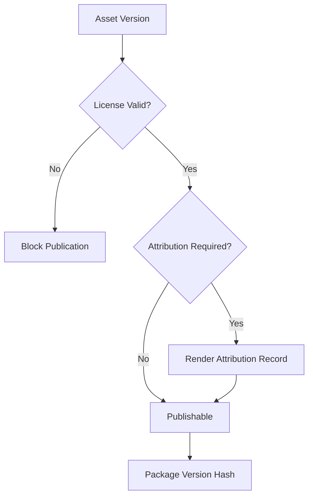

### 4.5 Recommended Operating Policy

- Default to WathiqCare-owned or tenant-owned assets for strategic categories.
- Use third-party licenses only for specialty gaps, animations, or premium visuals.
- Maintain a quarterly license compliance review.
- Ensure every evidence package can show what asset version was delivered and under which source/license basis.

---

## 5. Consent Integration Design

### 5.1 Placement in User Journey

The educational module must appear in this order:

1. Patient enters consent session
2. Procedure-specific educational package loads
3. Patient consumes educational package
4. Patient acknowledges education completion
5. System records education completion evidence
6. Consent text becomes available
7. Signature flow becomes available

### 5.2 Integration Modes

#### Authenticated Clinical Mode

- Used inside staff-operated consent workflows.
- Clinician can preview what patient education package is attached.
- Clinician can see completion state but not override legal completion evidence without an audit trail.

#### Public Signing Mode

- Used in secure token-based patient signing.
- Education step is enforced after OTP or immediately before consent text review, depending on legal workflow policy.
- Public session cookie and token context remain unchanged.
- Education completion session is bound to the same consent document and signing session.

### 5.3 Integration State Machine

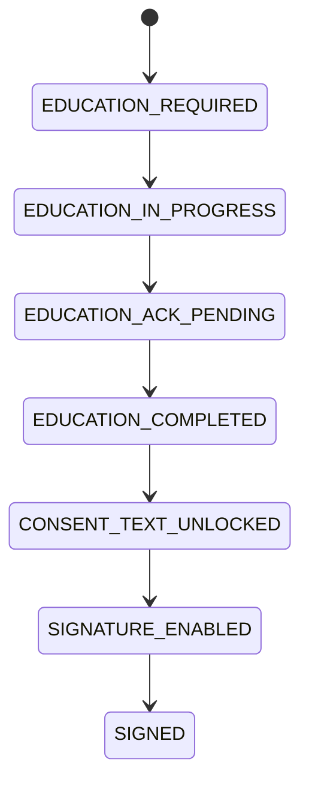

### 5.4 Gate Conditions

Consent text unlock condition:

- education package resolved
- required educational assets accessed according to policy
- acknowledgement recorded

Signature enable condition:

- consent text displayed
- education completion evidence linked to session
- no missing required educational acknowledgement

### 5.5 Template Mapping Strategy

Every consent template version maps to:

- one primary education package version
- zero or more fallback package versions
- one completion policy
- one locale policy
- one specialty override set

### 5.6 Failure and Fallback Rules

- If no package exists, the system falls back to a generic approved education package only if legal policy permits it.
- If asset delivery fails, the completion gate remains blocked for mandatory content.
- If only an optional asset fails, the package may continue with an audit event describing degraded delivery.

---

## 6. Educational Evidence Package Design

### 6.1 Goal

Educational evidence must become part of the legal evidence package, not a detached analytics log.

### 6.2 Evidence Payload Contents

The education section of the evidence package should include:

- education package ID
- education package version label
- education package content hash
- content locale
- asset list delivered to patient
- asset version hashes
- source and license references
- completion session ID
- start timestamp
- completion timestamp
- total duration
- viewed assets and durations
- FAQ interactions
- patient acknowledgement status
- acknowledgement timestamp
- acknowledgement text hash
- device/browser/IP metadata
- linkage to consent document ID and signing session ID

### 6.3 Evidence Timeline Design

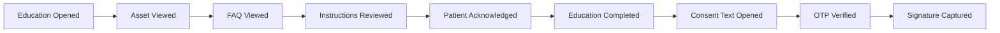

### 6.4 Evidence Integration with Existing Sidecar Pattern

The design should follow the current evidence sidecar pattern already used in the repo:

- education completion events become sidecar evidence events
- consent evidence builder aggregates education, OTP, consent, and signature evidence into a unified timeline
- immutable evidence vault metadata stores education summary and package hash references

### 6.5 Deterministic Education Summary

Recommended generated summary fields:

- procedure name
- package version
- locale
- viewed yes/no
- completion yes/no
- duration seconds
- assets delivered count by type
- acknowledgement yes/no
- content hash

### 6.6 Legal Defensibility Rules

- The education package version must be frozen for a consent execution once the patient enters the flow.
- Late edits to education content cannot mutate historical evidence.
- Every evidence bundle must be able to answer what was shown, when it was shown, which version was shown, and under which source/license basis.

---

## 7. UI/UX Flow

### 7.1 End-to-End Experience

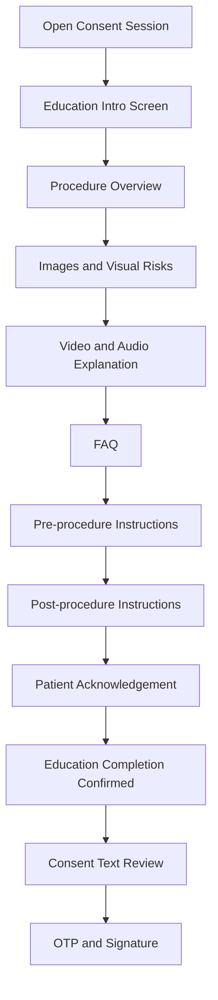

### 7.2 UX Principles

- Do not overload the patient with a long legal block before education.
- Make the educational stage visually distinct from the consent stage.
- Use bilingual Arabic/English content with strong readability.
- Show progress through the education package.
- Explain why acknowledgement is required.
- Preserve accessibility for mobile, low-bandwidth, and caption-dependent users.

### 7.3 Screen Model

1. Education landing screen
   Explains the procedure-specific educational package and expected duration.

2. Package content screen
   Shows ordered educational sections: images, videos, visuals, FAQs, pre-op and post-op instructions.

3. Acknowledgement screen
   Requires the patient to affirm review and understanding before consent text unlock.

4. Consent transition screen
   Confirms education completion and moves the patient into legal consent review.

### 7.4 UI Components

- Education progress header
- Procedure summary card
- Visual risk and benefit cards
- Video player with transcript and captions
- FAQ accordion
- Instruction checklists
- Patient acknowledgement panel
- Completion confirmation panel

### 7.5 Accessibility Requirements

- Captions for every video
- Transcripts for every audio/video asset
- Alt text for visual illustrations
- Keyboard navigation for all interactions
- Screen-reader-friendly progress and status text

---

## 8. Scalability Plan for 100+ Consent Templates

### 8.1 Scaling Problem

The module must support 100+ consent templates without duplicating educational content package authoring for every template.

### 8.2 Scaling Strategy

Use layered reuse:

1. Clinical domain layer
   Shared packages for high-level specialties such as surgery, cardiology, radiology, obstetrics, emergency care.

2. Procedure family layer
   Shared packages for families such as endoscopy, catheterization, biopsy, anesthesia, general treatment consent.

3. Template-specific overlay layer
   Small overlays for template-specific instructions or risk visuals.

### 8.3 Composition Model

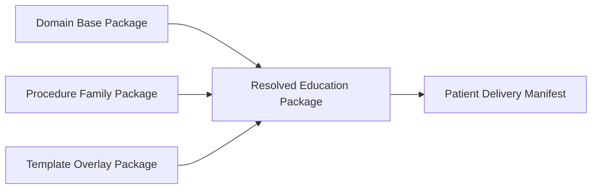

### 8.4 Scale Controls

- Shared asset pools across specialties
- Package manifests generated from reusable blocks
- Central FAQ library with specialty tags
- Template-to-package mapping table rather than hardcoded branching
- Derived locale variants rather than separate ad hoc packages where possible

### 8.5 Operational Model for 100+ Templates

- 10 to 15 domain base packages
- 25 to 40 procedure family packages
- 100+ template mappings
- small overlay sets for hospital-specific workflows

This keeps authoring manageable while preserving specificity.

---

## 9. Reusable Education Package Framework

### 9.1 Framework Goal

The framework must allow reusable assembly of educational experiences from composable content blocks rather than from monolithic one-off pages.

### 9.2 Package Block Types

- `procedure_overview`
- `why_this_procedure`
- `benefit_visuals`
- `risk_visuals`
- `pre_procedure_instructions`
- `post_procedure_instructions`
- `faq_block`
- `video_explainer`
- `image_gallery`
- `patient_acknowledgement_block`

### 9.3 Package Manifest Design

Every package version should resolve to a deterministic manifest with:

- package metadata
- ordered blocks
- block configuration
- locale-specific content references
- asset references
- completion rules
- acknowledgement text
- source and license references
- version hash

### 9.4 Reuse Modes

1. Global reusable package
2. Tenant-specific override package
3. Template-specific overlay package
4. Emergency fallback package

### 9.5 Framework Diagram

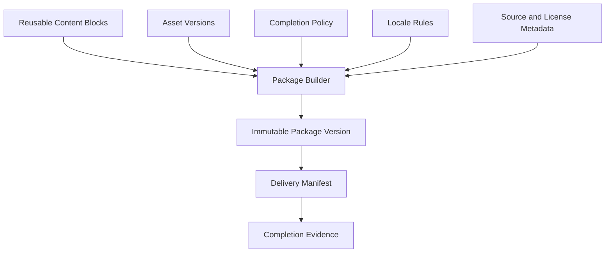

### 9.6 Recommended Governance Workflow

- author blocks
- review blocks clinically
- validate source and license metadata
- assemble package version
- approve package version
- map package version to template versions
- publish

---

## 10. Implementation Roadmap

This is a design roadmap only.

### Phase A: Foundations

- Define package manifest schema
- Define source and license metadata schema
- Define education completion event model
- Define consent template mapping rules
- Define non-breaking integration flags and rollout boundaries

### Phase B: Content Operations Backbone

- Stand up authoring and review workflow
- Establish source intake checklist
- Establish license compliance workflow
- Build initial package taxonomy by domain and procedure family

### Phase C: Runtime Delivery

- Add education package resolver
- Add patient-facing education experience before consent text
- Add acknowledgement and completion gate
- Attach education state to consent and signing sessions

### Phase D: Evidence and Legal Packaging

- Add education completion events to evidence aggregation
- Add deterministic education summaries and hashes
- Expose evidence timeline entries for education completion
- Include source/license provenance references in evidence metadata

### Phase E: Scale-Out

- Expand to 100+ template mappings
- Introduce tenant overlays and specialty packs
- Add analytics for package completion quality and drop-off
- Optimize CDN delivery and offline resilience

### Roadmap Diagram

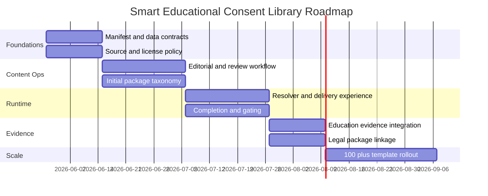

---

## Recommended Decision Summary

The Smart Educational Consent Library should be implemented as a non-breaking sidecar domain that:

- maps education package versions to consent template versions
- enforces education completion before consent text and signature
- stores immutable education package and asset version metadata
- records append-only completion evidence
- links education evidence into the existing legal evidence package model
- scales through reusable domain, procedure-family, and overlay package composition

This preserves current consent and signing architecture while elevating educational content into a legal-grade, clinically governed, reusable platform capability.