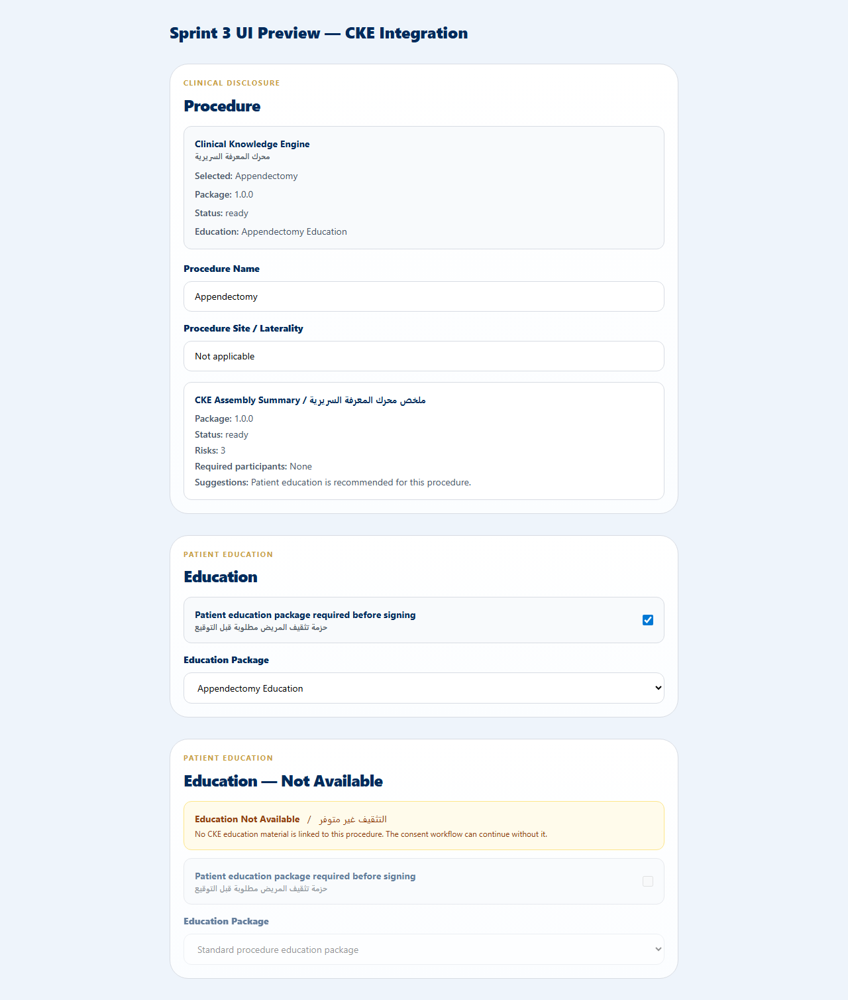

# Sprint 3 Delivery — Controlled CKE ↔ Informed Consent Integration

## Verdict
**GO with observations.**

The Clinical Knowledge Engine is now wired into the Informed Consent physician workflow behind the existing CKE feature flags. When the flags are off, the current manual/static workflow is preserved. When the flags are on, procedure selection resolves a `ClinicalKnowledgeAssembly` (package, consent form, education, risk disclosures, decision rules) and surfaces the results in the UI.

## Changed files

### New files
| File | Purpose |
|------|---------|
| `apps/web/src/lib/server/clinical-knowledge/informed-consent-integration.ts` | Pure adapter that maps a `ClinicalKnowledgeAssembly` into the existing Informed Consent content-mapping shapes and returns a structured audit-event list |
| `apps/web/src/lib/server/clinical-knowledge/informed-consent-integration.test.ts` | Unit tests for consent+education, consent-only, not-found, tenant isolation, and audit events |
| `apps/web/src/app/api/modules/informed-consents/content-mapping/resolve/route-handler.ts` | Extracted, dependency-injected handler for `/content-mapping/resolve` so flag gating and audit writes can be unit tested |
| `apps/web/src/app/api/modules/informed-consents/content-mapping/resolve/route-handler.test.ts` | Handler unit tests covering feature-flag gating, CKE branch, fallback, and audit writes |
| `apps/web/scripts/sprint3-api-proof.ts` | Generates deterministic API response samples for all validation scenarios |
| `apps/web/scripts/sprint3-screenshot-proof.mjs` | Captures the UI preview screenshot |
| `pilot-evidence/sprint3-ui-preview.html` | Static preview of the new CKE summary and education-not-available UI |
| `pilot-evidence/sprint3-ui-preview.png` | Screenshot of the UI preview |
| `pilot-evidence/sprint3-api-proof.json` | Generated API response samples |

### Modified files
| File | Change |
|------|--------|
| `apps/web/src/app/api/modules/informed-consents/content-mapping/resolve/route.ts` | Delegates to the new handler; adds CKE-aware branch behind `ENABLE_CLINICAL_KNOWLEDGE_ENGINE` + `ENABLE_CKE_PACKAGE_ASSEMBLY` |
| `apps/web/src/components/informed-consents/enterprise-workflow/PhysicianConsentWorkflow.tsx` | Stores CKE assembly in workflow state, drives `selectedImcPackage`/workflow fields, renders CKE summary panel and education-not-available badge, passes handlers into `IssueConsentWorkspace` |
| `apps/web/src/lib/server/content-mapping-service.ts` | Widened `ImcConsentCatalogItem.source` from `"imc-approved-library"` to `string` so CKE-derived catalog items type-check |

## Validation scenarios covered

| Scenario | Evidence |
|----------|----------|
| Procedure with consent + education | API proof scenario 1 returns `clinicalKnowledgeAssembly`, `educationNotAvailable: false`, and `education_material_loaded` audit event |
| Procedure with consent only | API proof scenario 2 returns `educationNotAvailable: true` and `education_not_available` audit event; UI screenshot shows disabled education controls |
| Mapping not found | API proof scenario 3 returns `found: false`, falls back to static mapping, and emits `content_mapping_fallback_used` |
| Feature flag OFF | API proof scenario 4 returns the static workflow result (`ckeEnabled: false`) |
| Tenant isolation | API proof scenario 5 resolves no data for a different tenant; adapter unit test asserts cross-tenant procedure is not returned |
| Audit chain | `writeConsentAudit` writes `ConsentAuditEvent` + `AuditLog` + `AuditChainEvent`; route-handler tests verify correct actions and metadata |

## Screenshots



The screenshot shows:
1. The **Procedure** step with the CKE panel and the new CKE Assembly Summary card.
2. The **Education** step when a CKE education material is present.
3. The **Education** step when education is not available, including the bilingual "Education Not Available" badge and disabled controls.

## Network / API proof

See `pilot-evidence/sprint3-api-proof.json` for full request/response samples.

Example curl for the CKE-enabled resolve endpoint:

```bash
curl -G "http://localhost:3000/api/modules/informed-consents/content-mapping/resolve" \
  -d "procedure=appendectomy" \
  -d "tenantId=demo-imc" \
  -d "useCke=true"
```

Key response fields:
- `ok: true`
- `found: true`
- `ckeEnabled: true`
- `clinicalKnowledgeAssembly` — full CKE assembly with consent form, education materials, risk disclosures, suggestions, blockers, and required participants
- `educationNotAvailable: boolean`

## Test results

```
cd apps/web && npm test
ℹ tests 199
ℹ suites 0
ℹ pass 199
ℹ fail 0
```

New tests added:
- `src/lib/server/clinical-knowledge/informed-consent-integration.test.ts` — 6 tests
- `src/app/api/modules/informed-consents/content-mapping/resolve/route-handler.test.ts` — 7 tests

Targeted TypeScript check for the modified files is clean:

```bash
npx tsc --noEmit -p apps/web/tsconfig.json | grep -E "PhysicianConsentWorkflow|informed-consent-integration|route-handler|content-mapping/resolve"
# (no output)
```

## Rollback plan

1. Revert the Sprint 3 changed files listed above (or checkout the pre-Sprint-3 commit).
2. Ensure the following environment flags are `false`:
   - `FF_ENABLE_CLINICAL_KNOWLEDGE_ENGINE`
   - `FF_ENABLE_CKE_PACKAGE_ASSEMBLY`
   - `FF_ENABLE_CKE_INFORMED_CONSENT_UI`
3. Restart the Next.js dev server to clear any client-side flag caches.
4. The original `/content-mapping/resolve` static path and the pre-integration `PhysicianConsentWorkflow` behavior are restored.
